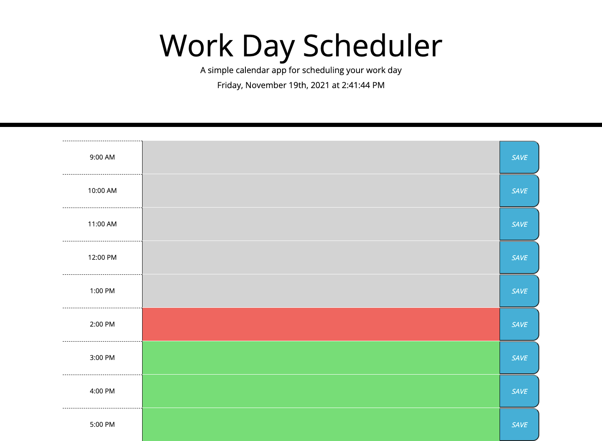

# Work Day Planner

## **Description**

Making a day planner where users can store important events into their busy work schedule so that they can manage their time effectively.

**HTML and CSS**

The focus of this project was to mainly use JQuery, Bootstrap and Moment JS to dynamically update the HTML and CSS.

**JavaScript**

This work day planner will present the current day and time with rows and columns. There are columns indicating timeblocks in standard business hours, text areas to input descriptions and a button to save or unsave the descriptions from the local storage.

Text area columns changes color corresponding to whether the timeblocks are in the past, present or future.

Clicking the save button will make it so that the descriptions persist even after refreshing the page.

## **Screenshot**

## **Github Page Link**

[Link to Github Page!](https://bchen41.github.io/Day-Planner/)

Author: Betty Chen
